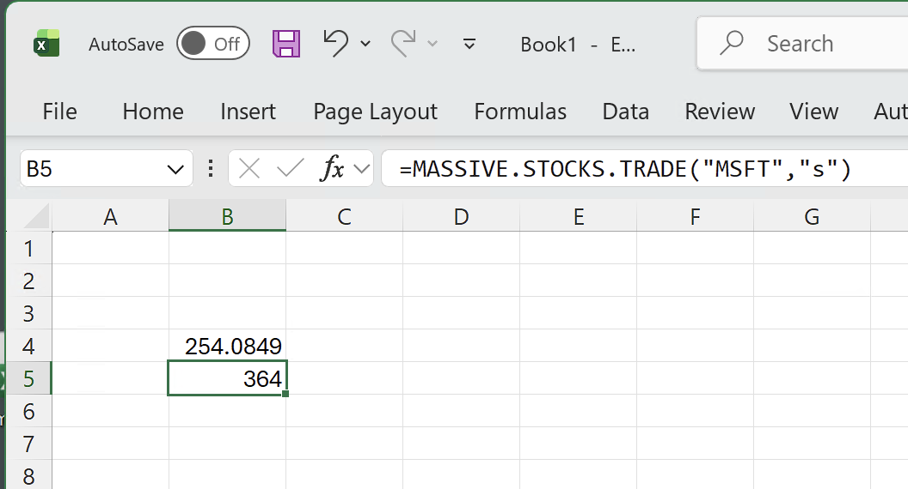
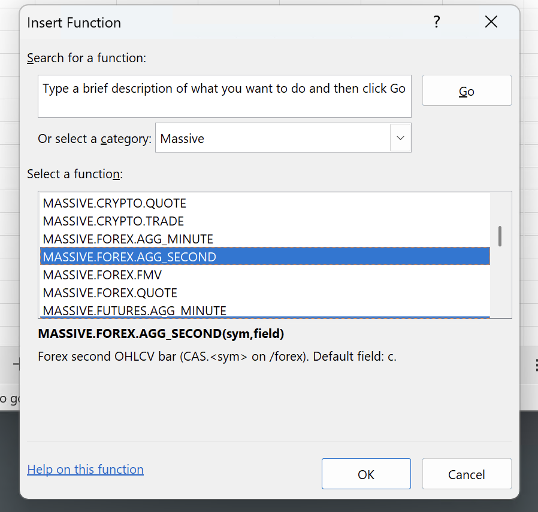
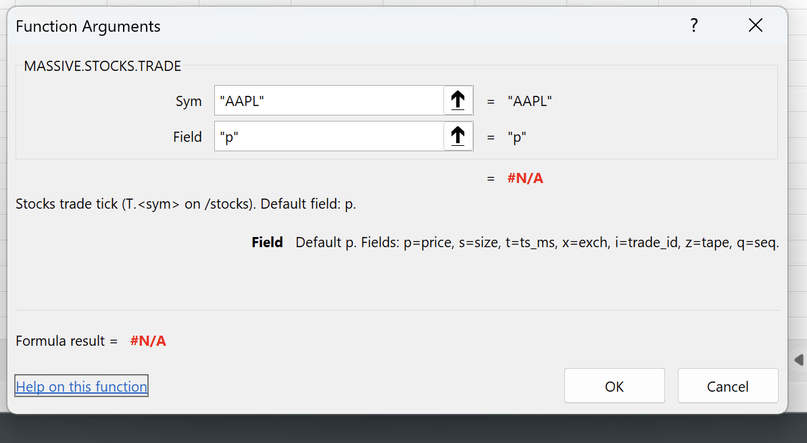

# massive-excel

This is an Excel add-in that streams live market data from the [Massive](https://massive.com) [WebSocket API](https://massive.com/docs/websocket/quickstart) into cells in your workbook.



> **Not affiliated with Massive.** An independent, unofficial client. Not endorsed by or associated with Massive. "Massive" and related marks belong to their respective owners and are used here only to describe interoperability. Your use of the Massive API is governed by Massive's own terms.
>
> **You need a paid Massive plan with WebSocket access.** This add-in does not source market data; it is a websocket client to the Massive API that runs within Excel. You supply the API key and the plan in your `config.json`. This is covered in this doc.
>
> **Data only. Not financial or trading advice.** No warranty is made as to accuracy, completeness or timeliness.
>
> **AI-assisted.** Some of the more repetitive aspects of mirroring the Massive API in Excel were completed by AI agents working from the Massive docs and clients for other languages. Optimizations to the TLS and WSS client was mostly implemented by AI. The output has been checked, but please [raise an issue](https://github.com/AlexJReid/zigxll-connectors-wss/issues) if you notice something off.

## Quick start

1. **Download the XLL.** Grab `massive_excel.xll` from the [latest GitHub release](https://github.com/AlexJReid/zigxll-connectors-wss/releases/latest) and copy it to your Windows machine. Release binaries are code-signed by **Lexvica Limited** via Azure Trusted Signing. If you build from your own fork, sign it with your own code-signing certificate.
2. **You may need to unblock it it.** Right-click the `.xll`, Properties, tick **Unblock**, OK. ([Why Excel blocks XLLs](https://support.microsoft.com/en-gb/topic/excel-is-blocking-untrusted-xll-add-ins-by-default-1e3752e2-1177-4444-a807-7b700266a6fb))
3. **Drop a `config.json`** in the same directory as the XLL, containing at least your API key:

   ```json
   {
     "api_key": "...",
     // optional
     "host": "socket.massive.com",
     "port": 443,
     "path": "/stocks", // default market
   }
   ```

   The host (`socket.massive.com`, `delayed.massive.com` and so on) is plan-dependent. See the [Massive WebSocket docs](https://massive.com/docs/websocket/quickstart) for the endpoint that matches whatyou have access to.

4. **Load the add-in.** Double-click the `.xll`, or add it via *File, Options, Add-ins, Excel Add-ins, Browse*.
5. **Try a formula.** In any cell:

   ```
   =MASSIVE("AM.AAPL.p")
   ```

   It should start updating with aggregate-minute AAPL trade prices. Depending on time of day, liquidity, aggregation, give it about a minute to update. See next section for the full topic format.

## API coverage

There's one Excel UDF per (market, event), so the market is part of the function name and there's no chance of routing a stocks-shaped channel to a crypto socket. Each wrapper takes a symbol and an optional field; omit the field to get a sensible default.



### Some examples

```
=MASSIVE.STOCKS.TRADE("AAPL")                last AAPL trade price (T.AAPL.p)
=MASSIVE.STOCKS.QUOTE("MSFT","bp")           MSFT best bid (Q.MSFT.bp)
=MASSIVE.STOCKS.AGG_MINUTE("TSLA","a")       TSLA minute-bar VWAP (AM.TSLA.a)
=MASSIVE.CRYPTO.TRADE("BTC-USD")             BTC-USD last trade on /crypto (XT.BTC-USD.p)
=MASSIVE.FOREX.QUOTE("EUR-USD")              EUR-USD ask on /forex (C.EUR-USD.a)
=MASSIVE.INDICES.VALUE("I:SPX")              S&P 500 index value (V.I:SPX.val)
=MASSIVE.OPTIONS.QUOTE("O:SPY251219C00600000")  SPY 600 call ask
=MASSIVE.FUTURES.TRADE("ESZ4")               ES futures last trade
```

If you need a topic shape that isn't covered, the generic escape hatch builds the wire channel by hand:

```
=MASSIVE("T.AAPL.p")                        stocks default market
=MASSIVE("XT.BTC-USD.p","crypto")           explicit market
```

All UDFs route through the same RTD server, so refcounting is shared. `=MASSIVE.STOCKS.TRADE("AAPL","p")` and `=RTD("zigxll.connectors.massive",,"T.AAPL.p")` resolve to one wire subscription. Refcounts are **per market**, so the same channel name on two markets is two independent subscriptions.

**Market access depends on your Massive plan.** Each market is a separate WebSocket endpoint (`wss://.../<market>`). Subscribing to one your API key isn't entitled to fails auth and the affected cells stay `#N/A`. See [Massive pricing](https://massive.com/pricing) for which plans cover which markets. You need one that includes WebSocket access.

### Excel function reference



Default field is what you get when the second argument is omitted. `<ev>` is the Massive wire prefix the wrapper sends; the wire channel is `<ev>.<sym>`.

| UDF | Wire `<ev>` | Endpoint | Default field |
|---|---|---|---|
| `MASSIVE.STOCKS.TRADE(sym,[field])` | `T` | `/stocks` | `p` |
| `MASSIVE.STOCKS.QUOTE(sym,[field])` | `Q` | `/stocks` | `ap` |
| `MASSIVE.STOCKS.AGG_MINUTE(sym,[field])` | `AM` | `/stocks` | `c` |
| `MASSIVE.STOCKS.AGG_SECOND(sym,[field])` | `A` | `/stocks` | `c` |
| `MASSIVE.STOCKS.FMV(sym,[field])` | `FMV` | `/stocks` | `fmv` |
| `MASSIVE.STOCKS.LULD(sym,[field])` | `LULD` | `/stocks` | `h` |
| `MASSIVE.OPTIONS.TRADE(sym,[field])` | `T` | `/options` | `p` |
| `MASSIVE.OPTIONS.QUOTE(sym,[field])` | `Q` | `/options` | `ap` |
| `MASSIVE.OPTIONS.AGG_MINUTE(sym,[field])` | `AM` | `/options` | `c` |
| `MASSIVE.OPTIONS.FMV(sym,[field])` | `FMV` | `/options` | `fmv` |
| `MASSIVE.FOREX.QUOTE(pair,[field])` | `C` | `/forex` | `a` |
| `MASSIVE.FOREX.AGG_MINUTE(pair,[field])` | `CA` | `/forex` | `c` |
| `MASSIVE.FOREX.AGG_SECOND(pair,[field])` | `CAS` | `/forex` | `c` |
| `MASSIVE.FOREX.FMV(pair,[field])` | `FMV` | `/forex` | `fmv` |
| `MASSIVE.CRYPTO.TRADE(pair,[field])` | `XT` | `/crypto` | `p` |
| `MASSIVE.CRYPTO.QUOTE(pair,[field])` | `XQ` | `/crypto` | `ap` |
| `MASSIVE.CRYPTO.AGG_MINUTE(pair,[field])` | `XA` | `/crypto` | `c` |
| `MASSIVE.CRYPTO.AGG_SECOND(pair,[field])` | `XAS` | `/crypto` | `c` |
| `MASSIVE.CRYPTO.FMV(pair,[field])` | `FMV` | `/crypto` | `fmv` |
| `MASSIVE.INDICES.VALUE(sym,[field])` | `V` | `/indices` | `val` |
| `MASSIVE.INDICES.AGG_MINUTE(sym,[field])` | `AM` | `/indices` | `c` |
| `MASSIVE.INDICES.AGG_SECOND(sym,[field])` | `A` | `/indices` | `c` |
| `MASSIVE.FUTURES.TRADE(sym,[field])` | `T` | `/futures` | `p` |
| `MASSIVE.FUTURES.QUOTE(sym,[field])` | `Q` | `/futures` | `ap` |
| `MASSIVE.FUTURES.AGG_MINUTE(sym,[field])` | `AM` | `/futures` | `c` |
| `MASSIVE(topic,[market])` | (raw) | any | (from `<ev>`) |

**Known gaps.** Per-second aggregates on options and futures aren't shipped: the docs say both per-minute and per-second payloads carry `ev:"AM"`, which collides with per-minute on our dispatch. Stocks NOI (net order imbalance) isn't wrapped yet either — both will land once the wire details are confirmed against a live feed.

### Field reference

Field tables per event, taken from the per-endpoint pages on [massive.com/docs/websocket](https://massive.com/docs/websocket/quickstart). Read each table alongside its event prefix — the same single-letter code can mean different things on different events. FMV timestamps are **nanoseconds** everywhere they appear; everything else is Unix milliseconds unless noted.

**Stocks trades** (`T`, `MASSIVE.STOCKS.TRADE`)

| Field | Meaning |
|---|---|
| `p` | trade price |
| `s` | trade size (shares) |
| `ds` | trade size including fractional shares (string) |
| `t` | SIP timestamp (Unix ms) |
| `x` | exchange id |
| `i` | trade id |
| `z` | tape (1=NYSE, 2=AMEX, 3=Nasdaq) |
| `c` | trade conditions (array) |
| `q` | sequence number |
| `trfi` | trade reporting facility id |
| `trft` | trade reporting facility timestamp (Unix ms) |

**Stocks quotes** (`Q`, `MASSIVE.STOCKS.QUOTE`)

| Field | Meaning |
|---|---|
| `bp` | bid price |
| `bs` | bid size (round lots; ×100 for shares) |
| `ap` | ask price |
| `as` | ask size (round lots; ×100 for shares) |
| `bx` | bid exchange id |
| `ax` | ask exchange id |
| `t` | SIP timestamp (Unix ms) |
| `z` | tape |
| `q` | sequence number |
| `c` | quote condition |
| `i` | indicator codes (array) |

**Stocks aggregates** (`AM` minute / `A` second, `MASSIVE.STOCKS.AGG_MINUTE` / `MASSIVE.STOCKS.AGG_SECOND`)

| Field | Meaning |
|---|---|
| `o` | open of the bar |
| `h` | high of the bar |
| `l` | low of the bar |
| `c` | close of the bar |
| `v` | volume in the bar |
| `dv` | volume including fractional shares (string) |
| `vw` | volume-weighted price for this bar |
| `op` | official opening price for the day |
| `av` | cumulative volume for the trading day |
| `dav` | cumulative volume with fractional shares (string) |
| `a` | day VWAP |
| `z` | average trade size in the bar |
| `s` | bar start (Unix ms) |
| `e` | bar end (Unix ms) |
| `otc` | OTC ticker flag (only present when true) |

**Stocks LULD** (`LULD`, `MASSIVE.STOCKS.LULD`)

| Field | Meaning |
|---|---|
| `h` | upper price band |
| `l` | lower price band |
| `i` | indicator codes (array) |
| `z` | tape |
| `t` | timestamp (Unix ms) |
| `q` | sequence number |

**Options trades** (`T`, `MASSIVE.OPTIONS.TRADE`)

| Field | Meaning |
|---|---|
| `p` | trade price |
| `s` | contracts traded |
| `t` | timestamp (Unix ms) |
| `x` | exchange id |
| `c` | trade conditions (array) |
| `q` | sequence number |

**Options quotes** (`Q`, `MASSIVE.OPTIONS.QUOTE`)

| Field | Meaning |
|---|---|
| `bp` | bid price |
| `bs` | bid size |
| `ap` | ask price |
| `as` | ask size |
| `bx` | bid exchange id |
| `ax` | ask exchange id |
| `t` | timestamp (Unix ms) |
| `q` | sequence number |

**Options aggregates** (`AM`, `MASSIVE.OPTIONS.AGG_MINUTE`) — same shape as stocks aggregates (`o/h/l/c/v/vw/op/av/a/z/s/e`).

**FMV** (`FMV`, `MASSIVE.{STOCKS,OPTIONS,FOREX,CRYPTO}.FMV`)

| Field | Meaning |
|---|---|
| `fmv` | fair market value |
| `t` | timestamp (Unix **nanoseconds**) |

Business-plan only. Unauthorized cells stay `#N/A`.

**Forex quotes** (`C`, `MASSIVE.FOREX.QUOTE`)

| Field | Meaning |
|---|---|
| `a` | ask price |
| `b` | bid price |
| `x` | exchange id |
| `t` | timestamp (Unix ms) |

Note: forex quotes use `a`/`b`, not `ap`/`bp`. The symbol comes back in a `pair` field, not `sym`.

**Forex aggregates** (`CA` minute / `CAS` second, `MASSIVE.FOREX.AGG_MINUTE` / `MASSIVE.FOREX.AGG_SECOND`)

| Field | Meaning |
|---|---|
| `o` | open of the window |
| `h` | high of the window |
| `l` | low of the window |
| `c` | close of the window |
| `v` | tick count in the window |
| `s` | window start (Unix ms) |
| `e` | window end (Unix ms) |

Forex aggregates derive from BBO quotes, not executed trades — `v` is a quote count, not a traded volume. No bar is emitted for windows with no quote updates.

**Crypto trades** (`XT`, `MASSIVE.CRYPTO.TRADE`)

| Field | Meaning |
|---|---|
| `p` | trade price |
| `s` | trade size |
| `t` | trade timestamp (Unix ms) |
| `x` | crypto exchange id |
| `i` | trade id (optional) |
| `c` | conditions (0=none, 1=sellside, 2=buyside) |
| `r` | Massive receive timestamp (Unix ms) |

**Crypto quotes** (`XQ`, `MASSIVE.CRYPTO.QUOTE`)

| Field | Meaning |
|---|---|
| `bp` | bid price |
| `bs` | bid size |
| `ap` | ask price |
| `as` | ask size |
| `x` | crypto exchange id |
| `t` | quote timestamp (Unix ms) |
| `r` | Massive receive timestamp (Unix ms) |

**Crypto aggregates** (`XA` minute / `XAS` second, `MASSIVE.CRYPTO.AGG_MINUTE` / `MASSIVE.CRYPTO.AGG_SECOND`)

| Field | Meaning |
|---|---|
| `o` | open of the window |
| `h` | high of the window |
| `l` | low of the window |
| `c` | close of the window |
| `v` | volume in the window |
| `vw` | VWAP for the window |
| `z` | average transaction size |
| `s` | window start (Unix ms) |
| `e` | window end (Unix ms) |

**Indices value** (`V`, `MASSIVE.INDICES.VALUE`)

| Field | Meaning |
|---|---|
| `val` | index value |
| `t` | timestamp (Unix ms) |

**Indices aggregates** (`AM` minute / `A` second, `MASSIVE.INDICES.AGG_MINUTE` / `MASSIVE.INDICES.AGG_SECOND`)

| Field | Meaning |
|---|---|
| `o` | opening index value within the window |
| `h` | high within the window |
| `l` | low within the window |
| `c` | closing index value within the window |
| `op` | official opening value for the day |
| `s` | window start (Unix ms) |
| `e` | window end (Unix ms) |

Index aggregates derive from index value updates, not trades. No bar is emitted when no value updates occur.

**Futures trades** (`T`, `MASSIVE.FUTURES.TRADE`)

| Field | Meaning |
|---|---|
| `p` | trade price (per unit; multiply by contract multiplier for full value) |
| `s` | contracts traded |
| `t` | timestamp (Unix ms) |
| `q` | sequence number |

**Futures quotes** (`Q`, `MASSIVE.FUTURES.QUOTE`)

| Field | Meaning |
|---|---|
| `bp` | bid price (per unit) |
| `bs` | bid size (contracts) |
| `ap` | ask price (per unit) |
| `as` | ask size (contracts) |
| `bt` | bid submission timestamp (Unix ms) |
| `at` | ask submission timestamp (Unix ms) |
| `t` | message timestamp (Unix ms) |

**Futures aggregates** (`AM`, `MASSIVE.FUTURES.AGG_MINUTE`)

| Field | Meaning |
|---|---|
| `o` | open of the window |
| `h` | high of the window |
| `l` | low of the window |
| `c` | close of the window |
| `v` | tick volume |
| `dv` | total US dollar value traded in the window |
| `n` | transaction count in the window |
| `s` | window start (Unix ms) |
| `e` | window end (Unix ms) |

**One subscription per channel.** Cells for `T.AAPL.p` and `T.AAPL.s` share a single `T.AAPL` subscribe on the wire and update from the same event stream. The unsubscribe goes out once the last `T.AAPL.*` cell is removed.

## Building from source

You only need to follow this section if you want to build the XLL yourself rather than use a release binary.
This add-in is written in Zig, using [ZigXLL](https://github.com/AlexJReid/zigxll).

### Zig

Zig 0.15.1 or later. `brew install zig`, your package manager, or [ziglang.org/download](https://ziglang.org/download). 

### Windows SDK (only for building the XLL)

The XLL cross-compiles from macOS or Linux to Windows using [xwin](https://jake-shadle.github.io/xwin/) to fetch the MSVC headers and libs. Native Windows builds need the Windows SDK installed directly. The Windows GitHub Actions runners already have it.

**macOS:**
```bash
brew install xwin
xwin --accept-license splat --output ~/.xwin
```

**Linux:**
```bash
cargo install xwin
xwin --accept-license splat --output ~/.xwin
```

### API key

Create a Massive account, generate an API key, and put it in `config.json` (see [Quick start](#quick-start) for the schema). The CLI looks for `./config.json` then `./src/config.json`; the XLL looks next to itself, then in `%APPDATA%\zigxll-massive\`. The file is `.gitignore`d.

Alternatively, set `MASSIVE_API_KEY` in the environment. It takes precedence over the file, and keeps the key off disk on CI or ephemeral shells.

The config is read once at startup and cached for the life of the process. Rotating the key requires an Excel (or CLI) restart.

### Build

```bash
zig build              # XLL (zig-out/lib/standalone.xll), cross-compiled to Windows
zig build massive-cli  # CLI smoke-tester (zig-out/bin/massive-cli)
```

By default the XLL and CLI connect to `wss://delayed.massive.com` with `/stocks` as the default market (15-minute delayed, usually free). A single build can talk to any market your API key covers; cells pick the market at runtime via the optional second RTD parameter.

Host, port, default path, TLS behaviour and API key are all set at runtime via `config.json` (see [Quick start](#quick-start) for the schema and locations). The same binary serves mock and prod. Example with all fields:

```json
{
  "host": "socket.massive.com",
  "port": 443,
  "path": "/stocks",
  "insecure": false,
  "api_key": "pk_live_..."
}
```

All fields are optional; missing ones fall back to compile-time defaults. See `src/config.json.example` for a template. `$MASSIVE_API_KEY` in the environment overrides `api_key` if both are set.

The `-Dmassive_*` build flags set those compile-time defaults, for reproducible CI builds where no config file is shipped. Most users can ignore them.

The RTD server registers itself in `HKCU\Software\Classes` on load, so no admin rights are needed.

| ProgID | CLSID |
|---|---|
| `zigxll.connectors.massive` | `{D146815B-1D01-4D0D-904C-292533090438}` |

## Smoke-test without Excel (mac/linux/windows)

A native binary that exercises the TLS client, WS framing, auth handshake and JSON dispatch against a local mock server. See [`tools/README.md`](tools/README.md) for the mock server's replay mode, environment variables, and the `fetch_flatfile.js` helper for pulling historical data from Massive's S3 endpoint.

**One-time setup:**

```bash
./tools/gen_cert.sh      # generate self-signed TLS cert in tools/cert.pem + tools/key.pem
npm install ws           # install Node WebSocket library
cat > src/config.json <<'EOF'
{ "host": "localhost", "port": 8443, "insecure": true, "api_key": "test-key" }
EOF
```

**Run:**

```bash
# terminal 1: start the mock Massive server
node tools/mock_server.js

# terminal 2: run the native CLI against it (reads src/config.json)
zig build run-cli -- T.AAPL Q.MSFT AM.TSLA

# to exercise a non-default market path:
zig build run-cli -- --market crypto XT.BTC-USD
```

Expected output (on the CLI side):

```
info(massive_cli): host=localhost port=8443 path=/stocks insecure=true
warning(massive_cli): TLS verification disabled
info(massive_cli): connecting...
info(massive_cli): connected
info(massive_cli): authenticated
info(massive_cli): subscribed to 3 channel(s)
< ev=T sym=AAPL x=4 i="631529681" z=3 p=256.7998 s=363 ...
< ev=Q sym=MSFT bp=532.6017 bs=259 ap=532.6217 as=54 t=...
< ev=AM sym=TSLA v=79218 vw=274.6887 o=274 c=274.7387 h=275.2387 l=274.2387 ...
```

Mock server environment variables:
- `MOCK_PORT`: default `8443`
- `MOCK_API_KEY`: default `test-key`
- `MOCK_TICK_MS`: default `500` (how often to emit a fake event per subscribed channel)

Swap `src/config.json` back to your real key and endpoint before running the CLI against production. The XLL reads its own `config.json` from the directory it was loaded from, so its config is unaffected by CLI mock testing.

### Pointing the XLL at the mock server

Same binary, same rules: the config file picks the endpoint. `./build-for-mock.sh` builds the XLL and writes a `config.json` next to it with `insecure: true`, `api_key: "test-key"` and your LAN IP as the host.

```bash
./build-for-mock.sh
# outputs: zig-out/lib/massive_excel.xll + zig-out/lib/config.json
```

Then on the Windows side:

1. Copy **both** `massive_excel.xll` and `config.json` from `zig-out/lib/` into the **same directory** on the Windows box.
2. Start the mock server somewhere reachable: `node tools/mock_server.js`.
3. The mock's self-signed cert doesn't need to match any trust store; `insecure: true` in the config skips verification.
4. Load the XLL in Excel, type `=MASSIVE("T.AAPL.p")`, confirm fake ticks arrive.
5. Multi-market smoke test: `=MASSIVE("XT.BTC-USD.p","crypto")` and `=MASSIVE("T.AAPL.p","stocks")` in two cells should open two separate WebSocket connections (the mock accepts any path), and the debug log (OutputDebugString, visible in DebugView) will show `[stocks]` and `[crypto]` worker lines.

**Watch out:** `insecure: true` skips TLS verification for **every** connection the XLL makes, including any real endpoint. Keep mock and prod installs in separate directories. The _config file_, not the binary, is what must never sit next to a production endpoint.

## Architecture

Pure Zig. Most of the code is a Zig implementation of the Massive wire protocol, plus a small amount of plumbing to expose it as an RTD server COM object. ZigXLL handles the COM and XLL side.

```
            ┌──────────────────────────────────────────┐
            │  Excel                                   │
            │    │                                     │
            │    ▼                                     │
            │  =RTD("zigxll.connectors.massive",       │
            │        ,"T.AAPL.p","stocks")             │
            │    │                                     │
            │    ▼                                     │
            │  xlfRtd ─────────► COM RTD server        │  (massive_excel.xll)
            │                       │                  │
            └───────────────────────┼──────────────────┘
                                    │ onConnect / onRefreshValue
                                    ▼
            ┌──────────────────────────────────────────┐
            │  massive_rtd.zig                         │
            │    Handler (flat topics map,             │
            │     routes each topic to a MarketConn    │
            │     by market name)                      │
            │        │                │                │
            │        ▼                ▼                │
            │  MarketConn(stocks) MarketConn(crypto)   │
            │    worker thread     worker thread       │
            │    refcount+queues   refcount+queues     │
            │        │                │                │
            │  ws_client.zig ─ TLS + RFC 6455          │
            │    (one Client per MarketConn)           │
            │        │                │                │
            └────────┼────────────────┼────────────────┘
                     │                │
                     ▼                ▼
             wss://.../stocks    wss://.../crypto
```

Key source files:

| File | Purpose |
|---|---|
| `src/ws_client.zig` | TLS and WebSocket client. HTTP upgrade handshake, masked frame writes, unmasked frame reads, auto-pong. Pure `std.crypto.tls` and `std.net`. |
| `src/massive_protocol.zig` | Massive wire protocol helpers (greet, auth, subscribe) and topic parsing. Shared by the RTD handler and the CLI. |
| `src/massive_rtd.zig` | RTD handler. Owns a pool of per-market `MarketConn`s, each with its own worker thread, TLS+WS client and channel refcounts. Routes topics by the optional second RTD parameter. |
| `src/massive_cli.zig` | Native CLI smoke-tester. Connects, auths, subscribes, prints every incoming event. |
| `src/functions.zig` | `=MASSIVE(topic)` and the per-event wrapper functions. |
| `src/main.zig` | Framework entry. Registers the function module and RTD server. |
| `src/ca_bundle.pem` | Mozilla CA roots from [curl.se](https://curl.se/ca/cacert.pem). Checked in for reproducible builds. |
| `build.zig` | Build graph: Windows XLL, native CLI, build options. |
| `tools/gen_cert.sh` | One-shot openssl script that generates a self-signed cert for the mock server. |
| `tools/mock_server.js` | Node mock Massive WebSocket server. Speaks the real wire protocol with fake data. |

## Known limitations

- **Market access is plan-dependent.** Each market (`stocks`, `options`, `forex`, `crypto`, `indices`, `futures`) is a separate WebSocket endpoint. You can only reach markets your API key is entitled to. The handler opens a connection lazily on the first topic for a market; if auth fails, the worker logs the status message and retries on the 2s reconnect timer. Cells pointed at unauthorised markets stay `#N/A`.
- **One connection per market.** Massive has no multiplexed endpoint. Each market is its own `wss://.../<market>` URL. The handler holds one connection per active market and shares it across all cells for that market.
- **One concurrent connection per asset class per API key.** Massive's default cap is one live WebSocket per asset class. Contact Massive support for more. Running two Excel instances against the same key on the same market will fail auth on the second. Its cells stay `#N/A` and the worker exits after logging the terminal error (no reconnect hammering).
- **Sub/unsub latency between market hours.** Each worker uses a 2s `poll`-gated read (`readMessageTimeout`) so queued sub/unsub actions flush on the next tick even when the server is idle. A client-initiated WS ping every 20s keeps NAT mappings warm. Intraday latency is sub-second. Worst-case off-hours latency is the poll interval.
- **64 KiB single-frame cap.** Fragmented or huge frames will error. Safe for the Massive wire format, which is small.
- **Reconnect.** On drop, the worker reconnects with a fixed 2s backoff forever, re-authenticates, and re-subscribes to all currently-live channels.

## A note on AI assistance

Some of the more repetitive work of mirroring the Massive API surface into Excel — the per-event wrapper functions, field mappings, and similar boilerplate — was generated with the help of AI agents. The output has been reviewed, but if you spot something off, please [raise an issue](https://github.com/AlexJReid/zigxll-connectors-wss/issues).

## Commercial

My company [Lexvica Limited](https://lexvica.com) can help with all aspects of your market data estate, including Excel integrations like this one, NATS, Zig, and Go.

This software is free to use and modify; if you're using it I'd love to hear from you - [alex@lexvica.com](mailto:alex@lexvica.com).
